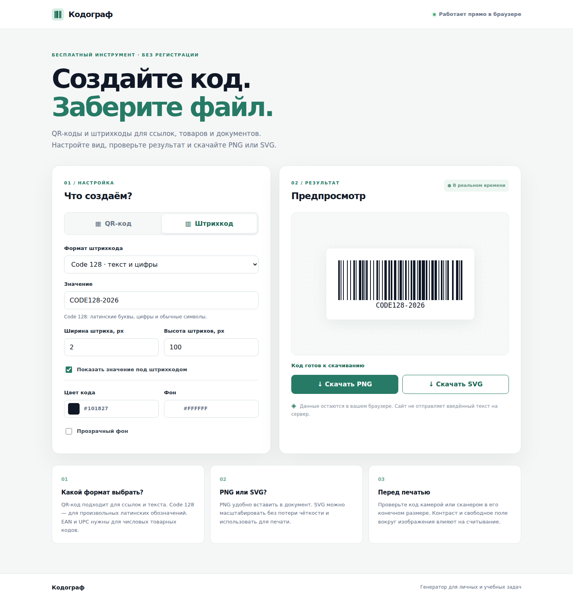

# Кодограф / Kodograf

**QR and barcode generator in your browser · Генератор QR-кодов и штрихкодов в браузере**

[Русский](#ru) · [English](#en)



<a id="ru"></a>

## Русский

**Кодограф** создаёт QR-коды и штрихкоды, показывает результат до скачивания и экспортирует его в PNG или SVG. Сайт работает без регистрации и серверной обработки: введённые данные остаются в браузере. Он подходит для публикации на GitHub Pages.

### Возможности

- QR-коды для текста, ссылок, Wi-Fi, адресов электронной почты и телефонных номеров.
- Штрихкоды Code 128, EAN-13, EAN-8, UPC-A, Code 39 и ITF-14.
- Настройка размера и цветов, прозрачный фон, подпись под штрихкодом и предпросмотр.
- Скачивание PNG или SVG; интерфейс адаптирован для телефона.
- Библиотеки находятся в `vendor/`: для генерации не требуются внешние CDN или API.

### Запуск локально

Откройте `index.html` в браузере. Можно также запустить локальный сервер из корня проекта:

```bash
python -m http.server 8000
```

После этого откройте `http://localhost:8000/`.

### Ограничения

- Штрихкоды в этой версии принимают латинские буквы, цифры и допустимые для выбранного формата символы. Кириллицу можно закодировать в QR-коде.
- EAN и UPC требуют значения установленной длины; контрольная цифра рассчитывается автоматически. Созданное изображение не означает, что товарный номер зарегистрирован.
- Перед печатью проверьте считывание кода в его конечном размере. Для прозрачного фона важна светлая и однородная поверхность.

### Технологии и лицензии

HTML, CSS и JavaScript без серверной части. Генерация штрихкодов: [JsBarcode 3.12.3](https://github.com/lindell/JsBarcode). Генерация QR: [node-qrcode 1.5.4](https://github.com/soldair/node-qrcode), собранный для браузера; зависимость [dijkstrajs](https://github.com/andrewhayward/dijkstra). Тексты лицензий сторонних библиотек находятся в `vendor/licenses/`.

Для исходного кода этого проекта отдельная лицензия пока не указана.

---

<a id="en"></a>

## English

**Kodograf** generates QR codes and barcodes in the browser, previews the result, and exports PNG or SVG files. It needs no account or server-side processing: input stays in the browser. The static site can be hosted on GitHub Pages.

### Features

- QR codes for text, URLs, Wi-Fi credentials, email addresses, and phone numbers.
- Code 128, EAN-13, EAN-8, UPC-A, Code 39, and ITF-14 barcodes.
- Adjustable size and colors, transparent background, optional barcode text, and live preview.
- PNG and SVG downloads; responsive interface for mobile devices.
- Libraries are bundled in `vendor/`; generation requires no external CDN or API.

### Run locally

Open `index.html` in your browser, or start a local server from the project root:

```bash
python -m http.server 8000
```

Then visit `http://localhost:8000/`.

### Limitations

- Barcodes in this version accept Latin characters, digits, and characters supported by the selected format. Use QR codes for Cyrillic text.
- EAN and UPC have fixed input lengths; a check digit is calculated automatically. Generating an image does not register a product identifier.
- Test the code with a scanner at its final print size. Transparent codes need a light, even surface for reliable scanning.

### Tech and licenses

HTML, CSS, and JavaScript; no backend. Barcode generation uses [JsBarcode 3.12.3](https://github.com/lindell/JsBarcode). QR generation uses [node-qrcode 1.5.4](https://github.com/soldair/node-qrcode), bundled for the browser, with [dijkstrajs](https://github.com/andrewhayward/dijkstra). Third-party license texts are in `vendor/licenses/`.

The project's own source code does not currently specify a license.
